[Requirement & Design Specification]{.mark}

**[Online Learning English System]{.mark}**

**[Group Member:]{.mark}**

**[Nguyễn Thế Duy - HE180374]{.mark}**

**[Phạm Đức Minh - HE180520]{.mark}**

**[Nguyễn Mạnh Trường - HE187209]{.mark}**

**[Version: 1.0]{.mark}**

> [-- Hanoi, January 2025 --]{.mark}

                                                                     

                                                                     

                                                                     

     
# [I. Overview]{.mark}

[Online Learning Web is an online learning system that allows users to
register, participate in, and teach online courses. The system provides
a platform for connecting students and instructors, supporting course
management, lectures, tests, certificates, payments, and
assessments.]{.mark}

[The first version of the system will focus on providing video courses,
homework support, and student assessments. In subsequent updates, the
system will expand features such as live classes, AI integration for
learning support, and links with international payment
platforms.]{.mark}

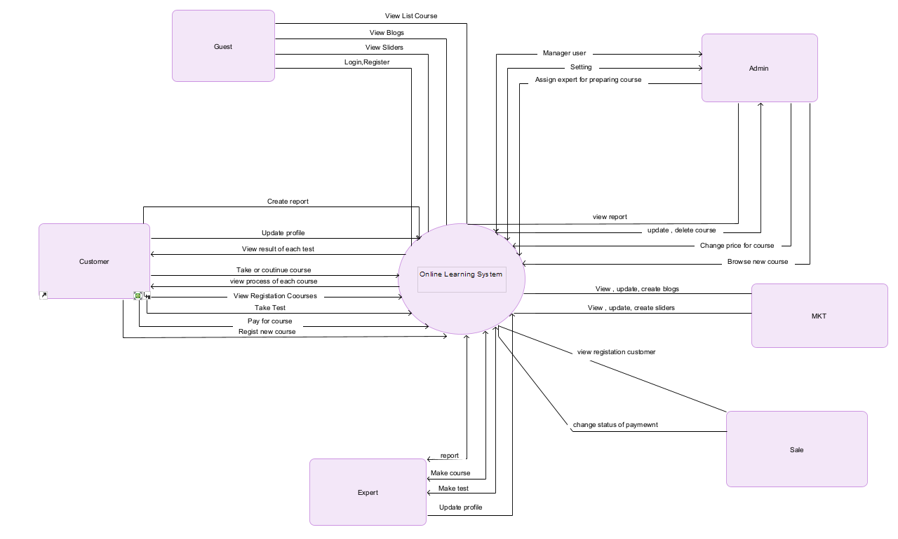

> **[Figure 1. Context diagram of Online Learning Web]{.mark}**

## [2. User Requirements]{.mark}

### [2.1 Actors]{.mark}
| # | **Actor**     | **Description**                                                                                                                                         |
|---|---------------|---------------------------------------------------------------------------------------------------------------------------------------------------------|
| 1 | Administrator | - Manage and operate the entire website system.                                                                                                         |
|   |               | - Check course content, user accounts and evaluate student quality.                                                                                     |
|   |               | - Ensure data security and safety and supplement system regulations.                                                                                    |
|   |               | - Handle issues related to payment, user feedback and error reporting system.                                                                           |
| 2 | Customer      | - Are registered users who want to participate in online learning.                                                                                      |
|   |               | - Can search, purchase and participate in suitable courses.                                                                                             |
|   |               | - Can track learning progress, take tests, and receive certificates after completing the course.                                                        |
|   |               | - Have the right to rate and comment on the course as well as the instructor.                                                                           |
| 3 | Experts       | - Be an instructor or expert in a specific field.                                                                                                       |
|   |               | - Can create, upload, and manage their own course content.                                                                                              |
|   |               | - Responsible for teaching, answering student questions, and grading assignments.                                                                      |
|   |               | - Can receive student feedback and improve course content based on feedback.                                                                           |
| 4 | Guest         | - Not registered or logged in to the system.                                                                                                            |
|   |               | - Can view the course list and information about the learning platform.                                                                                 |
|   |               | - Can find information about the instructor, reviews from students before registering.                                                                 |
|   |               | - Need to register an account to be able to buy courses and participate in learning.                                                                   |
| 5 | Marketing     | - Responsible for promoting courses to potential users.                                                                                                 |
|   |               | - Run advertising campaigns, optimize SEO, and analyze user data to increase marketing performance.                                                     |
|   |               | - Collaborate with instructors to create advertising content appropriate for each course.                                                              |
|   |               | - Monitor campaign performance and report results to administrators.                                                                                    |
| 6 | Sales         | - Assist customers with course registration and payment.                                                                                                |
|   |               | - Provide advice on appropriate study programs to suit each student's needs.                                                                           |
|   |               | - Handle account issues, refunds, or complaints from customers.                                                                                         |
|   |               | - Build customer relationships to increase sales and retain long-term users.                                                                            |

### [2.2 Diagrams]{.mark}

#### [2.2.1 UCs for Guest]{.mark}

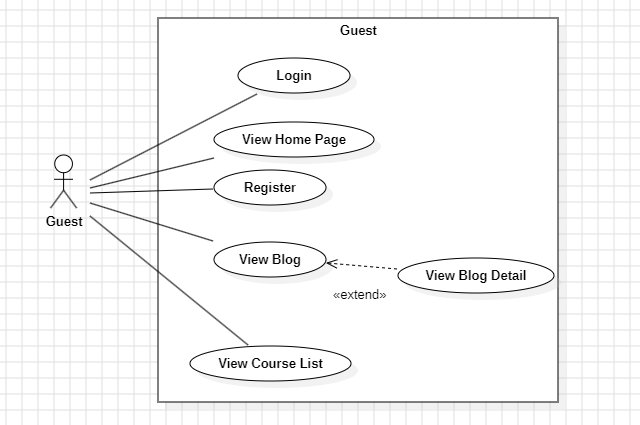

> **[Figure 2. User case of Guest]{.mark}**

#### [2.2.2 UCs for Expert]{.mark}

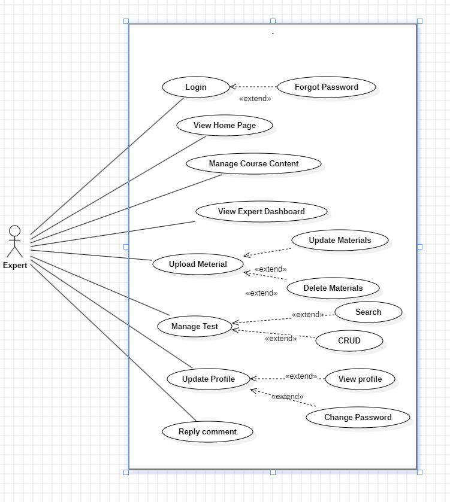

> **[Figure 3 . User case of Expert]{.mark}**

#### [2.2.3 UCs for Marketing]{.mark}

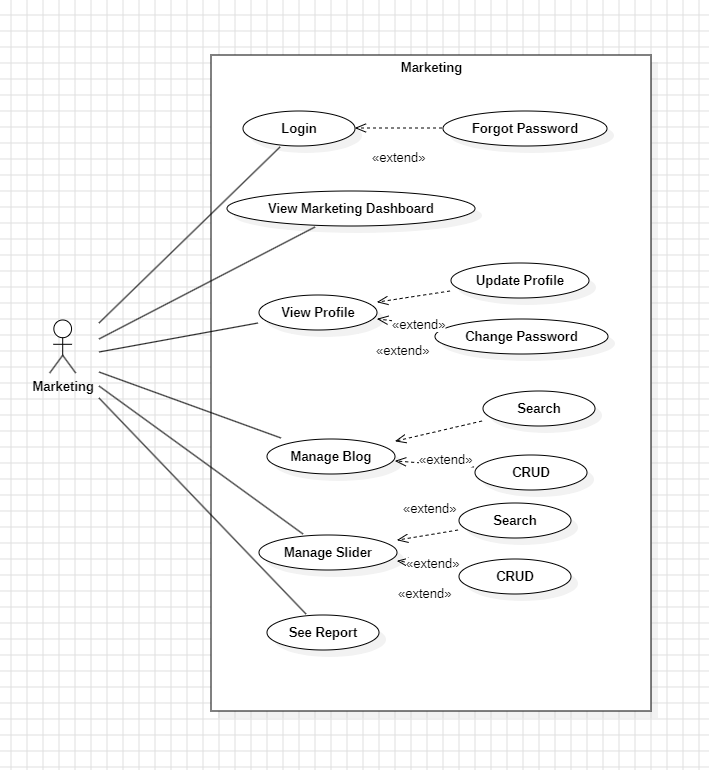

> **[Figure 4 . User case of Marketing]{.mark}**

#### [2.2.4 UCs for Sales]{.mark}

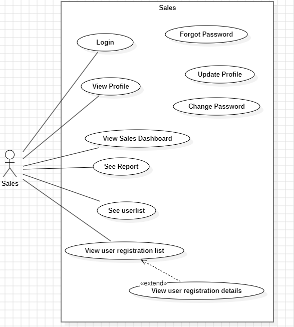

> **[Figure 5. User case of Sales]{.mark}**

#### [2.2.5 UCs for Customer]{.mark}

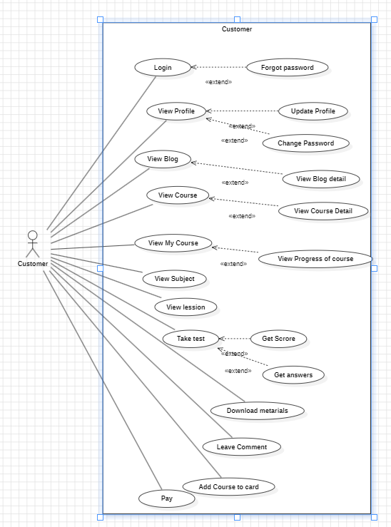

> **[Figure 6. User case of Customer]{.mark}**

#### [2.2.6 Ucs for Admin]{.mark}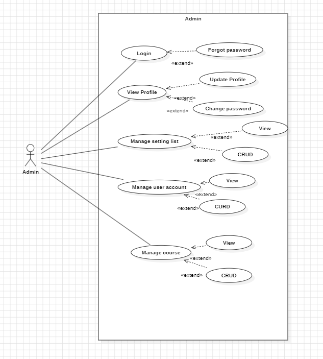

> **[Figure 7. User case of Admin]{.mark}**

### 

### 

### 

### 

                              |

### [2.4 Main Workflows]{.mark}

#### [1.2.1 Register Cousre Processing]{.mark}

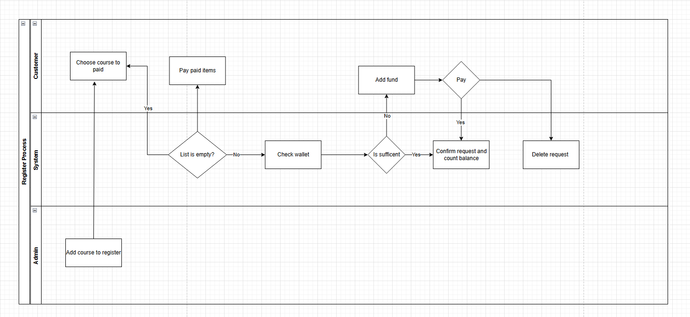

> **[Figure 8. Register Course Processing]{.mark}**

## [3. System Functionalities]{.mark}

### [3.1 Screens Flow]{.mark}

#### [3.1.1 Screen Flow of Online Learning Web]{.mark}

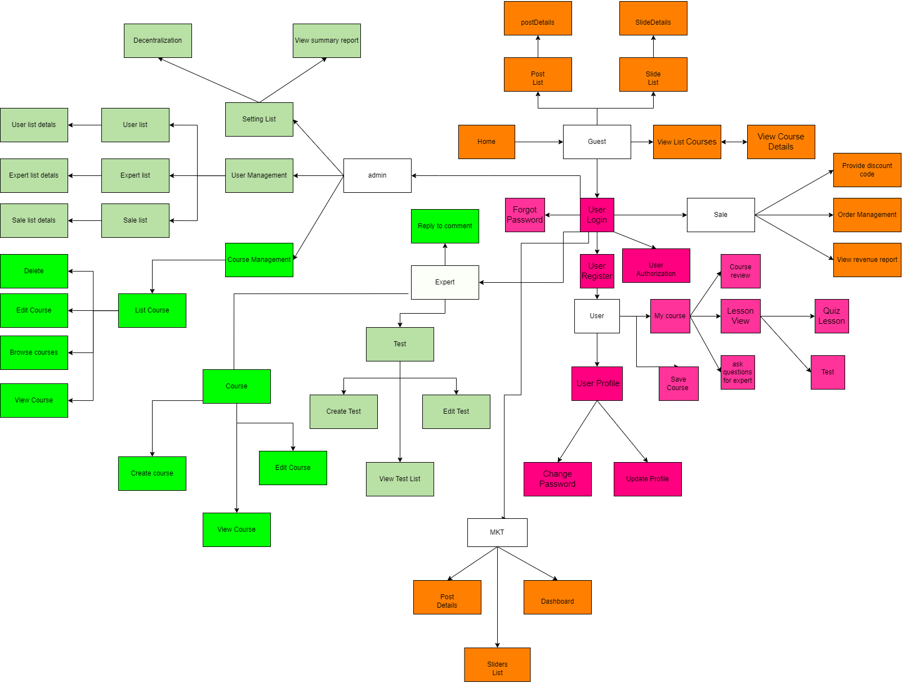

> **[Figure 9. Screen Flow of Online Learning Web]{.mark}**

#### [3.1.2 Screen Flow of Guest]{.mark}

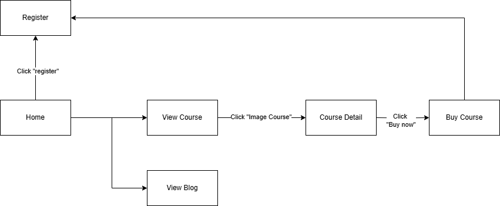

> **[Figure 10. Screen Flow of Guest]{.mark}**

#### [3.1.3 Screen Flow of Customer]{.mark}

> 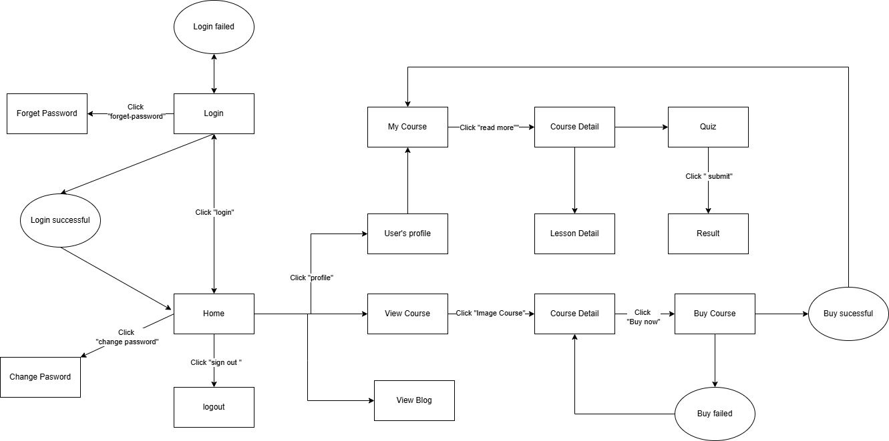
>
> **[Figure 11. Screen Flow of Customer]{.mark}**

#### [3.1.4 Screen Flow of Admin]{.mark}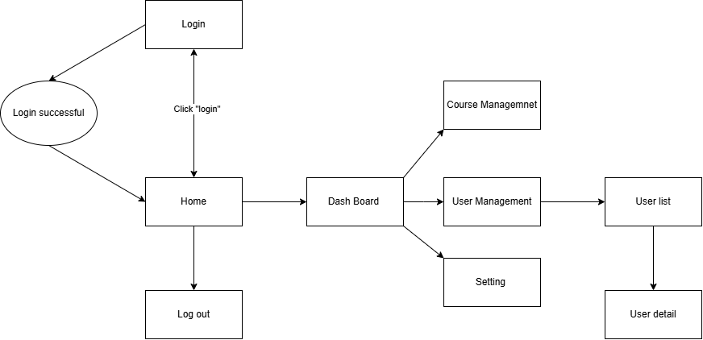

> **[Figure 12. Screen Flow of Admin]{.mark}**

#### [3.1.5 Screen Flow of Expert]{.mark}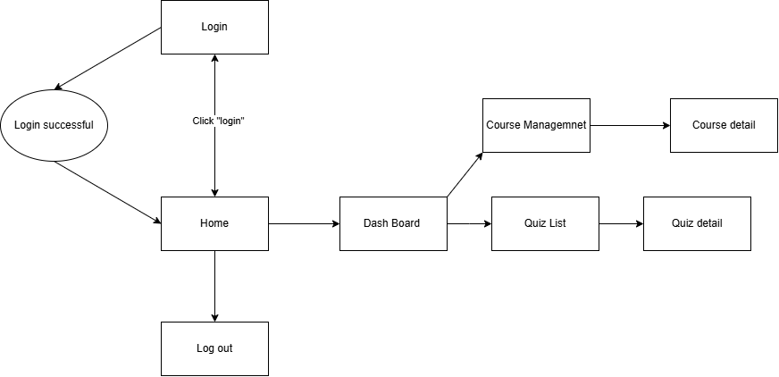

> **[Figure 13. Screen Flow of Expert]{.mark}**

#### [3.1.5 Screen Flow of Marketing]{.mark}

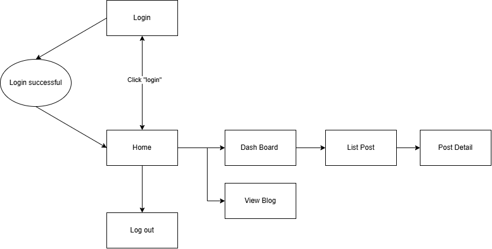

> **[Figure 14. Screen Flow of Marketing]{.mark}**
